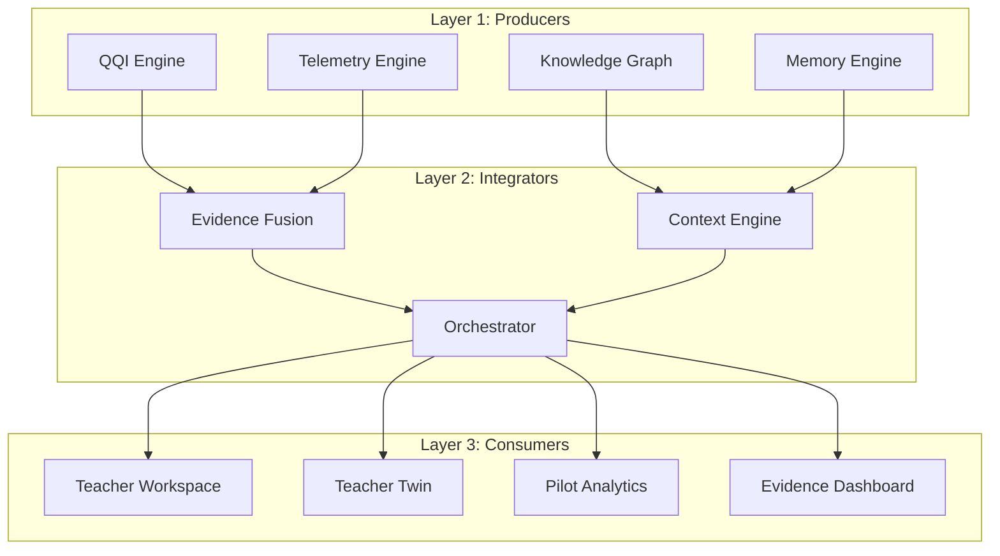

# Cognify — Universal Cognitive Intelligence Platform
## Master Project Context & Handover Document

> **IMPORTANT FOR ALL FUTURE AI DEVELOPERS & AGENTS:**
> Read this document first before starting any work on this codebase. Do NOT redesign the architecture. Do NOT introduce new AI models unless explicitly requested. Treat this as an architecture continuation, not a greenfield project.

---

## ===================================
## PROJECT STATUS
## ===================================

* **Architecture Status:** Frozen
* **Current Version:** `v1.9.0`
* **Current Sprint:** Week 10 Complete (QQI Calibration Feedback Loop ✅)
* **Current Focus:** Phase 3 Initialization

### 🚫 DO NOT:
* Redesign architecture
* Rename or duplicate existing modules/engines
* Replace existing core components

###  ALWAYS:
* Reuse current code and build on top of the frozen architecture
* Maintain backward compatibility with previous schemas and APIs
* Update documentation, changelog, and roadmap files
* Follow the strict sprint workflow: Implementation ➔ Unit Tests ➔ Integration Tests ➔ Manual Validation ➔ Update docs/walkthrough/changelog ➔ Commit using professional conventional format ➔ Push ➔ Tag

---

## 1. Core Mission & Philosophy

* **Mission:** 
  * *Evidence is the Product.*
  * *Intelligence is the Process.*
  * *Better Learning is the Outcome.*
* **The Goal:** Build the world's first Cognitive Intelligence Platform that understands **how** students learn rather than only **what** they answer. It is not just another LMS or quiz platform.
* **Core Principle:** **Evidence Before Intelligence**. Retraining of models or evolution of the prediction heads is postponed until sufficient real-world classroom evidence exists. The current dataset is mostly synthetic, so no model retraining should be attempted without explicit instruction. Everything in the core research history is append-only.

---

## 2. Current Architecture Status

* **Current Version:** `v1.3-week5-frozen`
* **Architecture Freeze:** The architecture is officially **FROZEN**. No redesigning, no replacing core components. All new features are to be built on top of the existing codebase.

### The Intelligence Stack & Layers

* **Layer 1 (Producers):**
  * **Question Quality Index (QQI):** Formulates item quality using a multi-signal 10-metric calculation.
  * **Living Knowledge Graph:** Directed Acyclic Graph (DAG) representing concept dependencies.
  * **Memory Engine / Telemetry:** High-frequency logging of hover, click, latency, backspaces, and option-change events.
* **Layer 2 (Integrators):**
  * **Evidence Fusion:** Merges evaluation heads (Understanding, Strategy, Behavior) to recursively update the student's Digital Twin.
  * **Context Engine:** Matches context (student history, current cognitive state) to target concepts.
  * **Orchestrator:** Coordinates interactions across Layer 1 and 2.
* **Layer 3 (Consumers):**
  * **Teacher Workspace & Twin:** Actionable pedagogical recommendation console and virtual representation.
  * **Pilot Analytics & Evidence Dashboard:** Live metrics, validation stats, and intervention results.

---

## 3. Database Schema & Intervention Tracking

### Key Tables
1. **`question_bank`**: Stores question metadata, including 10 QQI sub-scores:
   * Concept Purity, Discrimination, Difficulty Stability, Guess Resistance, Language Quality, Behavior Signal Strength, KG Mapping, Time Stability, Teacher Rating, and Historical Reliability.
2. **`intervention_history`**: Permanent, immutable research dataset (append-only).
   * Schema:
     * `intervention_id` (TEXT PRIMARY KEY)
     * `recommendation_id` (TEXT)
     * `student_email` (TEXT)
     * `teacher_email` (TEXT)
     * `question_id` (TEXT)
     * `concept_id` (TEXT)
     * `kg_version` (TEXT)
     * `qqi_version` (TEXT)
     * `model_version` (TEXT)
     * `pre_mastery` (REAL)
     * `post_mastery` (REAL)
     * `mastery_gain` (REAL)
     * `teacher_action` (TEXT)
     * `timestamp` (TEXT)

### Recommendation Lifecycle
Recommendations move through a strict state machine:
$$\text{Generated} \rightarrow \text{Viewed} \rightarrow \text{Accepted} \rightarrow \text{Executed} \rightarrow \text{Outcome Measured} \rightarrow \text{Verified}$$

### Metric Formulas
* **Teacher Trust Score:**
  $$\text{Teacher Trust} = \text{Acceptance Rate} \times \text{Execution Rate} \times \text{Observed Success Rate}$$
* **Statistical Validation:**
  Calculates Effect Size, Confidence Interval, and P-value.
  * **Constraint:** Only calculate if $\text{sample\_size} \ge 30$. Otherwise, return `"Insufficient Statistical Evidence"`.

---

## 4. Key Architectural Decisions (ADRs)

* **[ADR 001](file:///f:/Cognify/docs/ADR/ADR-001-Why-SQLite.md): SQLite for Production** — SQLite used in WAL (Write-Ahead Logging) mode with `busy_timeout=5000` to allow local deployment (School Twin) with zero configuration and low network latency.
* **[ADR 002](file:///f:/Cognify/docs/ADR/ADR-002-Why-Knowledge-Graph.md): Living Knowledge Graph** — Modeled as a DAG to capture causal learning dependencies. The graph evolves dynamically based on interaction telemetry.
* **[ADR 003](file:///f:/Cognify/docs/ADR/ADR-003-Why-QQI.md): QQI Engine** — Combines psychometrics with physical telemetry (latencies, hovers, backspaces) to filter out guessing and identify bad questions.
* **[ADR 004](file:///f:/Cognify/docs/ADR/ADR-004-Why-Random-Forest.md): Random Forest for Strategy Prediction** — Chosen over deep learning due to high explainability requirements and small, non-linear feature space.
* **[ADR 005](file:///f:/Cognify/docs/ADR/ADR-005-Why-EWMA.md): EWMA for Evidence Fusion** — Uses an exponential moving average ($\alpha=0.7$) to update the digital twin smoothly and resist noise.
* **[ADR 006](file:///f:/Cognify/docs/ADR/ADR-006-Automatic-Prerequisite-Discovery.md) / [008](file:///f:/Cognify/docs/ADR/ADR-008-Why-Candidate-Edge-Pipeline.md) / [009](file:///f:/Cognify/docs/ADR/ADR-009-Why-Statistical-Discovery-First.md): APD Pipeline** — Statistical discovery of prerequisite links using struggle data, verified by a candidate edge pipeline.
* **[ADR 007](file:///f:/Cognify/docs/ADR/ADR-007-Why-Human-Validation.md): Human-in-the-Loop Validation** — Ensures AI-discovered relationships are reviewed by teachers/experts to reject pedagogically unsound statistical anomalies.
* **[ADR 010](file:///f:/Cognify/docs/ADR/ADR-010-Misconceptions-Belong-To-Concepts.md): Misconceptions Belong to Concepts, Not Questions** — Decoupled cognitive gaps from individual questions to ensure stable tracking across question banks.
* **[ADR 011](file:///f:/Cognify/docs/ADR/ADR-011-Educational-Memory-Uses-Event-Sourcing.md): Educational Memory Uses Event Sourcing** — `memory_events` is the immutable append-only source of truth; `concept_memory` is a derived projection. Guarantees deterministic replay (Rule 11).
* **[ADR 012](file:///f:/Cognify/docs/ADR/ADR-012-Concept-Memory-Is-Derived-Projection.md): Concept Memory Is a Derived Projection** — `concept_memory` is never directly written; the projector function `project_concept_memory()` rebuilds it from `memory_events` after every event append.

---

## 5. Roadmap & Future Sprints

### Completed Sprints (Phase 1: Foundation)
* **Week 1:** QQI Engine (10-Metrics)
* **Week 2:** Teacher Workspace & Versioning Lifecycle
* **Week 3:** Living Knowledge Graph (7-Tier scale)
* **Week 4:** Classroom Pilot 1 Execution & Telemetry Logging
* **Week 5:** Pilot Analytics & Statistical Validation Engine

### Current/Next Sprint (Phase 2: Self Improving Intelligence)
Phase 2 has been fully completed. The task order was:
1. **Automatic Prerequisite Discovery (APD) v2.0** [Completed ✅]
2. **Misconception Discovery v2.0** [Completed ✅]
3. **Cross-module Integration & Regression Sprint (v2.0)** [Completed ✅]
4. **Educational Memory v2.0** [Completed ✅]
5. **Context Engine v2.0** [Completed ✅]
6. **QQI Calibration Feedback Loop** [Completed ✅]
*Phase 2 release v1.9.0 is now frozen.*

---

## 6. Strict Rules of Engagement

1. **No Duplication:** Do not create duplicate modules. Always inspect existing implementations (like `apd_engine.py`, `context_engine.py`, `pilot_analytics.py`, `qqi_engine.py`, `memory_engine.py`, `md_engine.py`, etc.) before modifying.
2. **Backward Compatibility:** All modifications must maintain backward compatibility with previous weeks' DB schemas and APIs.
3. **Implementation Lifecycle:**
   $$\text{Plan} \rightarrow \text{Implementation} \rightarrow \text{Unit Tests} \rightarrow \text{Integration Tests} \rightarrow \text{Documentation Update} \rightarrow \text{Git Commit} \rightarrow \text{GitHub Push} \rightarrow \text{Architecture Review}$$
4. **Pre-flight Checklist:** Before starting any new feature, answer:
   * Why does this exist?
   * Which database tables change?
   * Which APIs change?
   * Which ML models change?
   * Which research objective does it support?
   * Which startup moat does it strengthen?
